[1]: http://www.cburch.com/logisim/ "Logism"
[2]: http://k-map.sourceforge.net/ "K-Map Minimizer"

## Introduction:
#### Outline:

- [Introduction:](#introduction)
    - [Outline:](#outline)
    - [Recommended Free-ware:](#recommended-free-ware)
- [The Big Picture:](#the-big-picture)
- [The 0-9 Counter:](#the-0-9-counter)
  - [Synchronous Design:](#synchronous-design)
  - [Asynchronous Design:](#asynchronous-design)
- [The 0-5 Counter:](#the-0-5-counter)
- [The 0-5 Counter:](#the-0-5-counter-1)
- [The Minute Decoders:](#the-minute-decoders)
- [The Hour Decoder:](#the-hour-decoder)
- [Putting It All Together:](#putting-it-all-together)
- [Download:](#download)

#### Recommended Free-ware:

* [Logisim—graphical tool for designing and simulating digital logic circuits.][1]
* [K-Map Minimizer—software for minimizing boolean functions.][2]

## The Big Picture:
Here's a list of functions a digital clock must perform:
* Count the passing minutes, hours etc. (i.e., track the passage of time).
* Display the time visually.
* Adjust the 'current' time through user interaction.

To realize these functions electronically, we will need the following types of logic circuits and electronic elements:
* A Clock Signal — like the pendulum in an analog clock, something needs to be the "heartbeat" of our digital clock.
* Counters — circuits that count each passing time interval (seconds, minutes, hours) in binary.
* 7-Segment Displays — to display the time (other types of display would suffice, but these are common and easy to use).
* Decoders — a circuit which translates binary number signals to 7-segment display inputs.
* Buttons — for setting the time.

With all this in mind, a diagrammatic representation of our digital clock might be as follows:

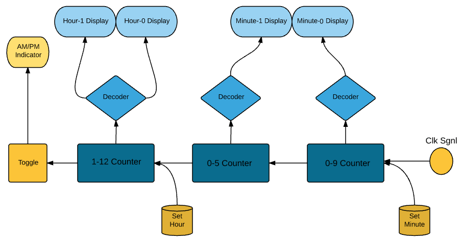

There are four 7-segment displays — two displays represent each digit of the hour, and two others display each minute digit. For clarity, let's denote the most significant hour digit as H&#x2081; and the least significant hour digit as *H&#x2080;*. Likewise for the minutes (i.e, *M&#x2081;* and  *M&#x2080;*).

Each display is driven by a counter, intermediated by a decoder. The counters output a binary digit, and the decoders translate binary to something decipherable by the 7-segment display.

Note the way the counters are arranged in a cascading fashion, starting with the clock signal and ending with the AM / PM indicator. The clock signal iterates the 0-9 counter (representing *M&#x2080;*) once each minute *1&#x2044;60 Hz*). Each time the 0-9 counter iterates from *M&#x2080; = 9* to *M&#x2080; = 0* it sends out a signal that iterates the 0-5 counter (representing *M&#x2081;*). A similar process takes place for the 1-12 counter and AM / PM indicator.

A couple of notes about this diagrammatic sketch: first, there are any number of ways we might sketch out and design our digital clock. This is just the simplest I could come up with. Second, you might be wondering why the *H&#x2081;* and *H&#x2080;* digits are together driven by a single counter, whereas the *M&#x2081;* and *M&#x2080;* are individually driven by two separate counters. Again, this isn't the only possible choice, but I'll explain why I did this in a [later section](#the-1-12-counter-).

## The 0-9 Counter:
A counter circuit is a [sequential logic]() circuit. Thus, we could design [synchronous]() or [asynchronous]() versions of the circuit. For this first counter I'll illustrate both methods: we'll find that asynchronous counters are generally simpler, so I'll only provide asynchronous designs for the 0-5 and 1-12 counters.

### Synchronous Design:

Generally, a sequential circuit requires the use of *flip-flops*. For our design, I have chosen to use *T* (or toggle) flip-flops. (The choice of flip-flop is, to a degree, arbitrary, as various flip-flops can be constructed from one another. However, certain pragmatic concerns may make one the better option. I have chosen T flip-flops simply because I like them).

The T flip-flop's logic circuit, block diagram, and excitation table are shown above. When the *T* input of the the T flip-flop is '1' (true or high), the current state of the flip flop, *Q*, toggles to its logical opposite on each clock pulse. If the *T* input is '0' (false or low) the state of the flip-flop is unchanged. Lastly, if the *Preset* or *Reset* inputs are '1', the state will asynchrnously (i.e., instantly, irrespective of *clk*) become '1' or '0' respectively.

As always in digital electronics, we'll be doing our counting in binary. For the 0-9 counter, the largest number we will need to represent is 9&#x2081;&#x2080;, which in binary is four bits, 1001&#x2082;. Each bit will be expressed by the output, *Q*, of a flip flop. So we'll need four flip-flops.

Let's enumerate the flip-flop inputs and outputs for ease of communication. We'll denote the output of the flip-flop representing the least significant bit as *Q&#x2080;* and its corresponding input as *T&#x2080;*. The next input-output pair will be *Q&#x2081;* and *T&#x2081;*, and so on. Thus, if we want to represent the number 5&#x2081;&#x2080; (i.e.,  0101&#x2082;), then the output of each flip-flop should be *Q&#x2083; = 0*,  *Q&#x2082; = 1*,  *Q&#x2081; = 0*, and  *Q&#x2080; = 1*.

Now we have all the information we need to compose an excitation table for our 0-9 counter circuit:

For each value represented by the current state, Q&#x2083;( t ) Q&#x2082;( t ) Q&#x2081;( t ) Q&#x2080;( t ), the corresponding next state, Q&#x2083;( t + 1 ) Q&#x2082;( t + 1 ) Q&#x2081;( t + 1 ) Q&#x2080;( t + 1 ), must represent the current value plus one (i.e., we're counting).

To determine the value of a given T&#8342; we consult the T flip-flop's excitation table. If  , then  . If Q&#8342;( t ) &#8800; Q&#8342;( t + 1 ), then T&#8342; = 0.

The Clk Out values are determined merely by recalling that we want the circuit to send out a clock signal whenever it has flipped from its highest to lowest numeric value.

Finally, the 'x's denote "don't care" conditions; if our circuit has been properly designed, the inputs with the "don't care" conditions will never occur, so we can safely assume that a given 'x' is either a '1' or '0', whichever simplifies our function most.

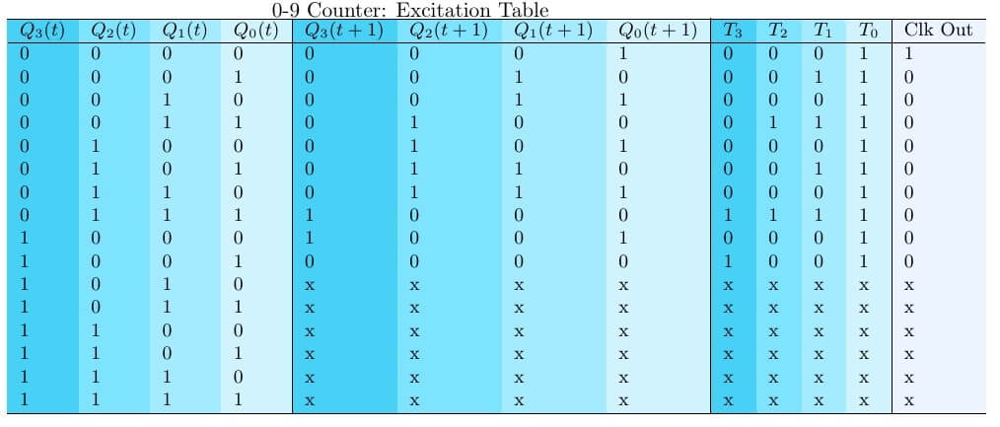

Now we utilize the excitation table to derive boolean functions for each T input in terms of each Q output. The most efficient method to do this is by means of Karnaugh map minimization. You can do this by hand, or use [this software (K-Map Minimizer)][2]. I have provided my K-map analysis below.

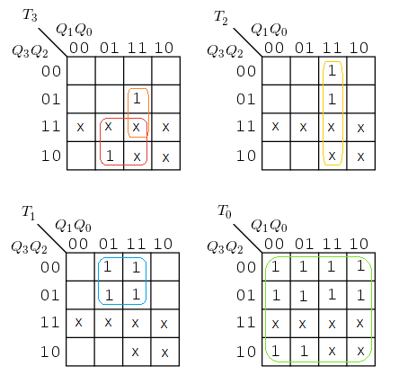

If you are unfamiliar with K-map minimization, read through this [wikipedia page](https://en.wikipedia.org/wiki/Karnaugh_map) or [download](https://web.archive.org/web/20170416232229/http://philectrosophy.com/documents/The%20Map%20Method%20For%20Synthesis%20of.pdf) Maurice Karnaugh's original 1953 paper.

The resulting equations are as follows:

A similar analysis yields the function for the output clk signal:

All that is left to do is to implement these equations into a logic circuit with our four flip-flops (below).

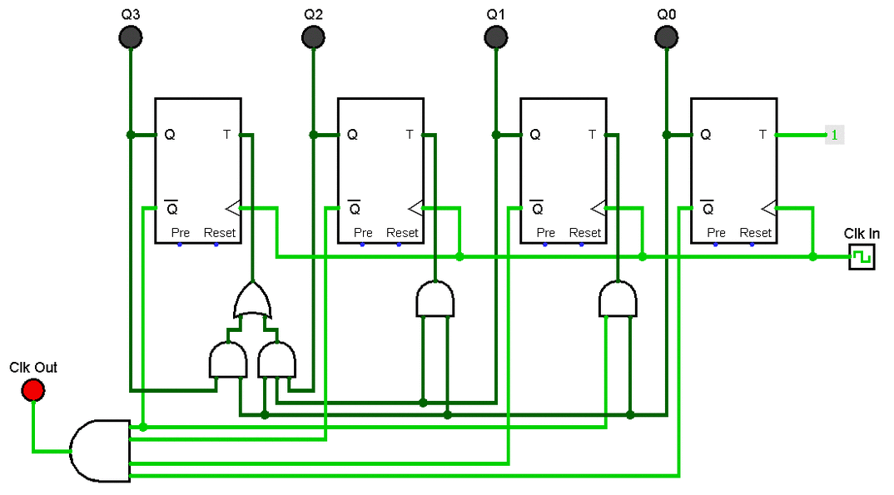

The 0-9 counter is now complete! The *Clk In* terminal connects to the *1&#x2044;60 Hz* (1 min) clk signal. Clk Out will connect to the input clock of the next counter (which we're building next). The Q&#x2083;,  Q&#x2082;,  Q&#x2081;, and Q&#x2080; outputs will eventually connect to a *decoder* circuit (which we will build later). For now, however, if you want to see the 0-9 counter in action, connect each of the Q outputs to an LED or probe in order to see the circuit count in binary.

If you aren't already doing so, [download][1] this free software to construct your circuit virtually.

### Asynchronous Design:

Consider the 4 bit counting sequence below. Note that Q&#x2081; changes exactly half as often as Q&#x2080;, Q&#x2082; changes half as often as Q&#x2081;, and so on.

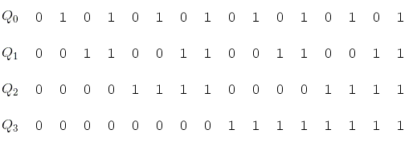

Now, if each Q&#8342; is the output of a T flip-flop, consider when it would be necessary that the corresponding clock signal *clk*&#8342; triggers. The timing diagram is shown below. Again we see that *clk*&#x2081; changes exactly half as often as *clk*&#x2080;, *clk*&#x2082; half as often as *clk*&#x2081;, and so on. This makes sense because a flip-flop can only change on a clock signal (ignoring the *Preset* and *Reset* inputs).

If we overlay these two images, we see that there is an inherent symmetry at work.

We can utilize that symmetry to greatly simply our counter design. By simply making the output of each Q&#8342; the input of the subsequent *clk*&#8342;&#8330;&#x2081; we create a 1 - 15&#x2081;&#x2080; counter!

This is nice and all, but of course we don't actually want to count all the way up to 15&#x2081;&#x2080;. Rather, we want to reset back to 0&#x2081;&#x2080; after we've reached 9&#x2081;&#x2080;.

The solution is simple! We simply need to set each *Reset*&#8342; to '1' at the appropriate moment. In this case, that moment would be the instance our circuit tries to count to 10&#x2081;&#x2080;.

Utilizing a truth table (below) with the properties specified above, and some Karnaugh minimization we can derive the requisite boolean function for the Reset inputs:

 

And don't forget that we need an output clock signal for the 0-5 counter. Since this signal should occur at exactly the same time as  occurs, the function is identical: 

All that is left to do is assemble the circuit (below).

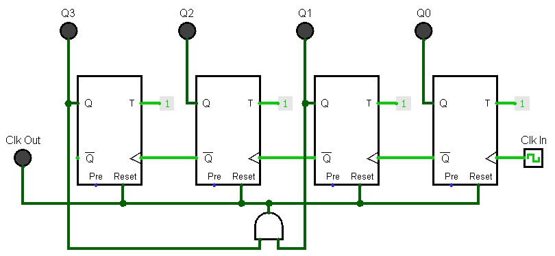

It's clear that when it comes to counting circuits, because of the correspondence between when bits flip and when clk-signals must occur, employing an asynchronous design yields a more compact circuit. Thus, for all subsequent counters we will only go over asynchrnous designs. *(Note that the output clock signal is not visible in the circuit below because it occurs for only a fraction of a second)*.

## The 0-5 Counter:
The procedure here is exactly like before. The only notable difference is that in order to represent our largest number 5&#x2081;&#x2080; we only need 3 bits 1015&#x2082;  and thus only 3 flip flops.

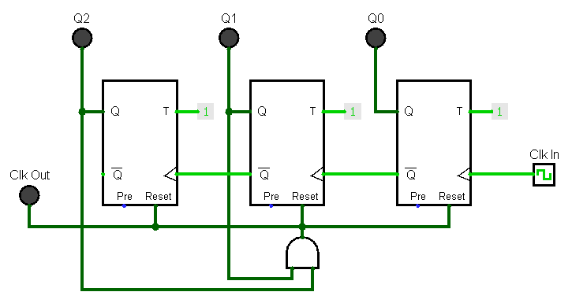

## The 1-12 Counter:
Recall from [The Big Picture](#the-big-picture) that the H&#x2081; and H&#x2080; digits are together driven by a single counter, whereas the M&#x2081; and M&#x2080; were individually driven by two separate counters. Why have I designed it this way?

Well, imagine for a moment designing the hour counters such that one counter drove H&#x2081; and another drove H&#x2080;, as we did with the minutes. This would require the H&#x2080; counter to count from 1 to 9, then from 1 to 2 (and repeat). And the H&#x2081; counter would have to count from 0 to 1, but at irregular intervals. These would make for some pretty unwieldy circuits. Counters like this *could* be built (probably synchronously), but it would be a somewhat awkward and confusing procedure. And why bother with that?

We can greatly simplify matters by having a single circuit that counts from 1-12. However, in order to have this single counter drive two 7-segment displays (one for H&#x2081; and one for H&#x2080;), we'll later have to construct a decoder the splits the outputs into to two separate sets. But we'll cross that bridge when we get there.

The procedure here is very much that same as with our previous counters, with two exceptions:

* First, when our 1-12 counter resets it flips to 1&#x2081;&#x2080; rather than 0&#x2081;&#x2080;. This translates to the necessity that Q&#x2080; = 1 whenever we begin a new cycle. To do this, instead of connecting a wire to Reset&#x2080;, we connect it to Preset&#x2080;, which will instantly set Q&#x2080; = 1 when the wire is 'ON'.
* Second,the output clock signal should trigger when the counter reaches 12&#x2081;&#x2080; rather than when the hours reset to 1&#x2081;&#x2080; (because... twelve hour clocks are weird. *Seriously, wouldn't it make more sense if the am/pm switch happened at 1am/pm?!* Just me? *Alternatively we could swap 12 for 0*..., anyway).

The circuit is below:

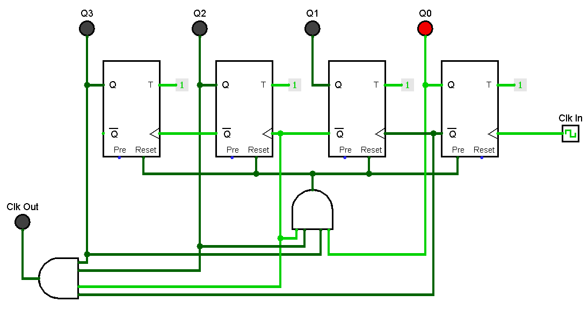

## The Minute Decoders:
Our counters output numbers in binary, but if you look at the average 7-segment display, binary is "unintelligible" to it. Most 7-segment displays are constructed such that each segment of the display is controlled by a single input (it's a common convention that each of these inputs is named with a letter, e.,g A, B, C,... etc.).

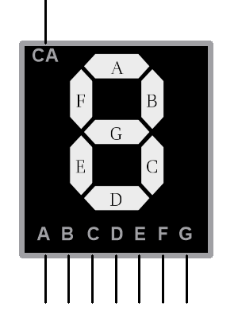

To translate from binary to individually lit segments we need a *decoder circuit*. A decoder is simply a circuit that takes a set of inputs operating in one convention, and translates (or 'decodes') them into a set of outputs operating in another convention. For example, you might use a decoder to go from binary to one-hot encoding, or grey code.

Since both the M&#x2081; and M&#x2080; decoders translate binary digits to a single 7-segment display, we can use the same design for both.

Decoders use [Combinational Logic](). So, we'll need a truth table. *(Note: I appear to have been a bit lazy in making the truth table below; interpret blank spaces as zeros).*

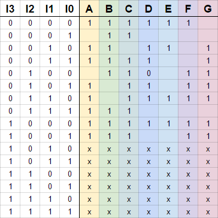

In order to fill out the truth table, it helps have on hand which segments need to be illuminated in order to represent each number:

Each input to the decoder I&#x2083;, I&#x2082;, I&#x2081;, and I&#x2080; corresponds to the outputs of the counter, Q&#x2083;, Q&#x2082; etc..

Utilizing K-Map minimization again we derive the following output equations:

And finally, we can construct the circuit... it's a large cumbersome thing, but it gets the job done.

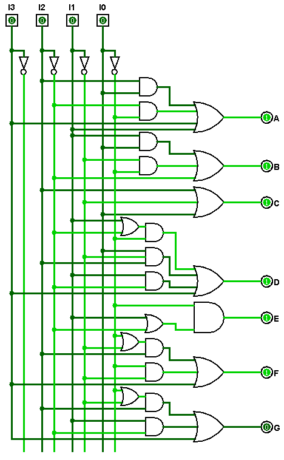

## The Hour Decoder:

Exactly the same principles are employed to design the hour decoder as were used with the minute decoders. However, in this case there will be two sets of outputs. Thus, our truth table and circuit will be twice as large and cumbersome as last time. They are included below.

In the circuit and truth table the A&#x2081;, B&#x2081;, C&#x2081;, ... etc. outputs all go to the H&#x2081; display, and the A&#x2080;, B&#x2080;, C&#x2080;,... etc. outputs all go to the H&#x2080; display. (Once again, blanks are to be interpreted as zeros).

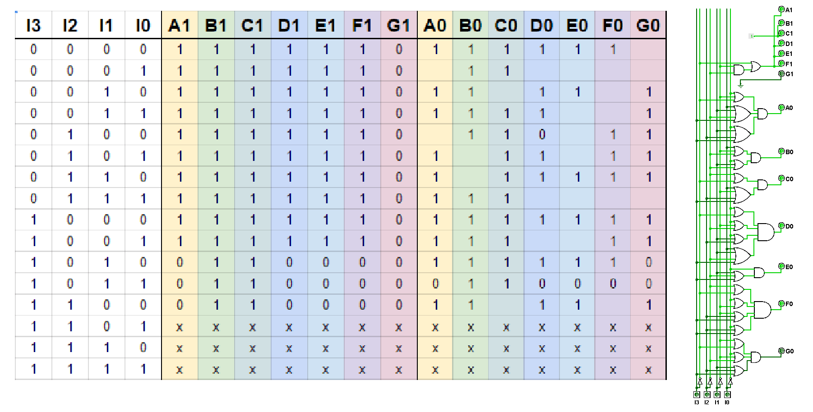

## Putting It All Together:

We've built everything we need! Now it's just a matter of putting it all together. Below is a gif of the fully assembled (virtual) clock showing a taste of it in action (I can only make gifs so long).

A couple of things to note:

* First, I've added 'Set Hour' and 'Set Minute' buttons XOR-ed with clock inputs of the M&#x2080; and H&#x2080; counters. This enables us to bypass the clock signals and get to the desired time with the push of a button (well, several pushes).

* Second, the Q&#x2083; input to the M&#x2081; decoder is connected to ground (or zero). This is because the M&#x2081; counter only uses 3-bits, so we'll never need to set Q&#x2083; = 1.

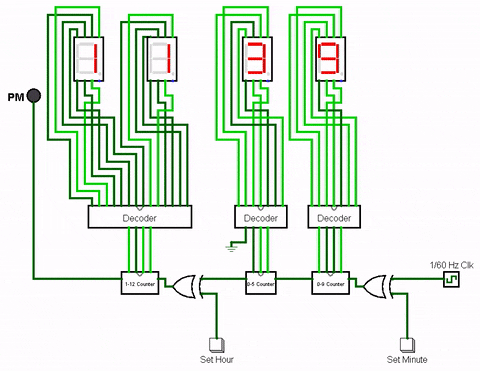

That's it! Feel free to comment below with any questions (WIP).

## Download:
I'm frequently asked for the Logisim files for the completed project. Thus, I'm including a download link below. Be sure to have [Logisim][1] installed.

* [Download]()
