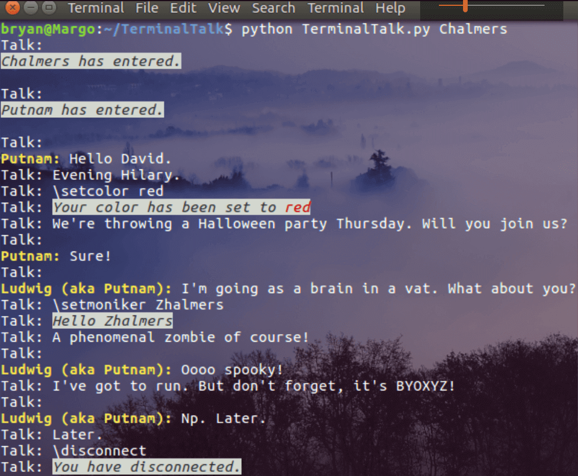
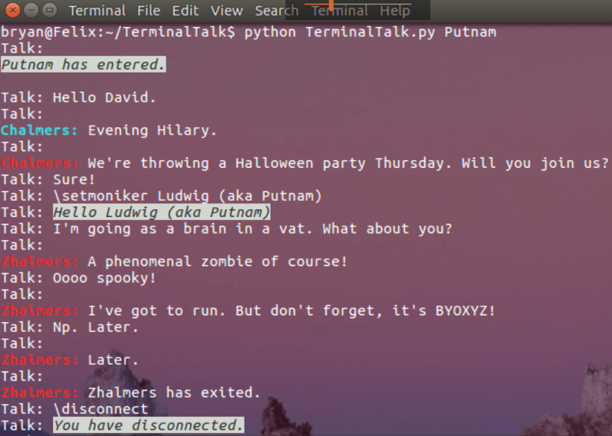

[1]: https://github.com/bbharper/TerminalTalk "Repository"

#### Source Code
[https://github.com/bbharper/TerminalTalk][1]

### Explanation

This fall I took a class in computer networking. A semester project was required. I knew that over Winter break I'd be building a server with a friend, so I decided it would be fun to develop a client-server application that we could host on our server. The end product is *TerminalTalk*.

*TerminalTalk* is a terminal based chat-room. Nothing too fancy, but it was loads of fun to make! It was written in Python. Below you can find some screen shots of the application complete with nerdy philosophy jokes. Additionally, I've included the report I submitted for my computer networking class along with the API for the application. You can find the source code for *TerminalTalk* [here][1].

*Note: The IP addresses included in the source code are all behind a NAT and so the application will not be useable to you as is. If you want to try the application, you'll have to host it on your machine and adjust the IPs accordingly.*

### Demo
Below is an example with two users having a conversation.

The first image shows the conversation from the perspective of the server, which can see messages and events from all users.

In the image below, the user Chalmers starts the application. The image demonstrates several features:
* The user can specify a username when starting the program (as an optional argument), or when the command `\setmoniker <name>`.
* When a user enters the chat, they are announced, e.g., `Chalmers has entered`
* The user can specify the color of their name with the `\setcolor <color>` command.
    * Available colors: black, red, green, yellow, blue, magenta, cyan, white
* Use the `\disconnect` command to, well, disconnect.

The image below shows the same conversation as above, but from Putnam's perspective.

### Report & API
I documented and explained the app pretty extensively in the paper I submitted for the assignment. Feel free to have a look:
[El E 245 -- TerminalTalk](resources/TerminalTalk.pdf)

#### Bonus:
There are some nerdy philosophy references in here, for anyone interested:
* [David Chalmers](https://en.wikipedia.org/wiki/David_Chalmers)
* [Hilary Putnam](https://en.wikipedia.org/wiki/Hilary_Putnam)
* [Phi Zombies](https://en.wikipedia.org/wiki/Philosophical_zombie)
* [Ludwig / Brain](https://en.wikipedia.org/wiki/Brain_in_a_vat)
* [XYZ](https://en.wikipedia.org/wiki/Twin_Earth_thought_experiment)
