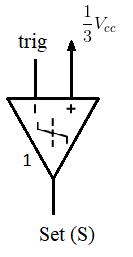
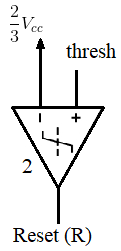
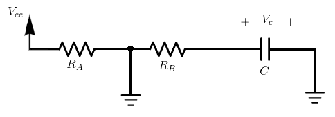
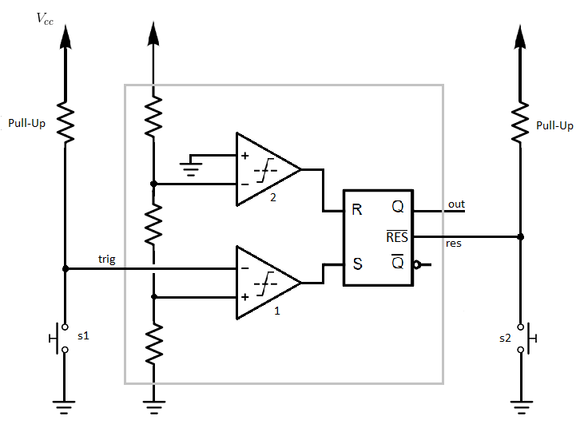
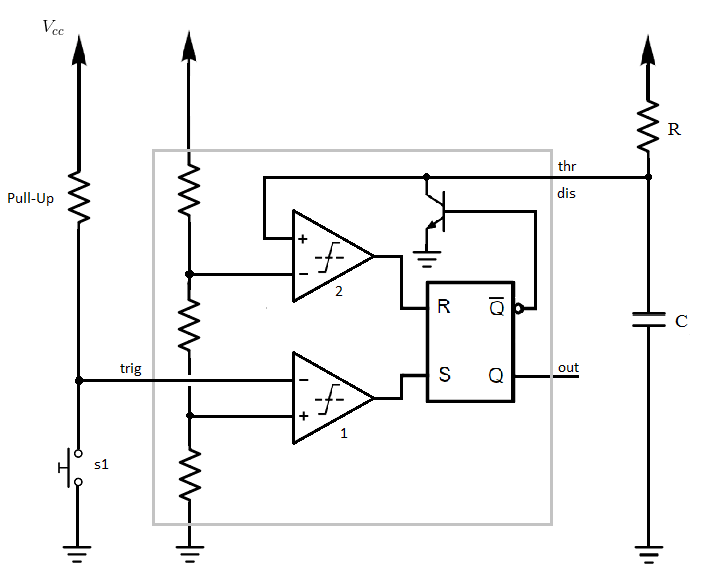

[comparator]: https://en.wikipedia.org/wiki/Comparator "Comparator"
[sr latch]: https://www.allaboutcircuits.com/textbook/digital/chpt-10/s-r-latch/ "SR Latch"
[oscillator]: https://en.wikipedia.org/wiki/Electronic_oscillator "Oscillator"
[astable sim]: https://everycircuit.com/circuit/6574783370362880 "Astable Mode Simulation"
[bistable sim]: https://everycircuit.com/circuit/4713056647249920 "Bistable Mode Simulation"
[monostable sim]: https://everycircuit.com/circuit/4531563207589888 "Monostable Mode Simulation"

### Introduction:
> Note: This lexicon entry will discuss the 555 Timer's general functionality. One should always consult the datasheet of any particular 555 IC for specifications unique to that chip.

The 555 Timer IC is a versatile chip that is in wide use. It is most commonly used for timing and clocking functions, but can also be used as an [oscillator], [SR latch][sr latch], and more. This entry will discuss the chip's three primary operating modes, the *astable*, *bistable*, and *monostable* modes.

### A Glance Inside:

Above is a schematic of the essential components of the 555 IC. Here are a few things to make note of at the outset:
* The three resistors between pins 1 and 8 are the same value. Thus, they will equally divide [IMATH]V_{cc}[/IMATH] in three, as indicated on the schematic. (These three resistors are usually *5kΩ* and are the namesake of the IC).
* Pin 5, the Control Voltage (*ctrl*) pin is a special purpose pin that often goes unused. Thus, you will see that in most applications it is simply connected to ground through a small capacitor (typically *10 nF* ) in order to stabilize it at [IMATH]\frac{2}{3} V_{cc}[/IMATH].
* The Trigger (*trig*) pin will determine the output of [comparator] 1, as the comparator's other input terminal is fixed at [IMATH]\frac{1}{3} V_{cc}[/IMATH]. Likewise, the Threshold (*thr*) pin will determine the output of comparator 2 as the comparator's other input terminal is fixed at [IMATH]\frac{2}{3} V_{cc}[/IMATH] (excepting when the *ctrl* pin is used, as discussed above). Together, the *trig* and *thresh* pins (generally) determine the Output (*out*) of the IC.
* In the schematic shown there is a grey, dashed box labelled "Output Stage". This is simply to indicate that there is more going on than what is shown. But the details of the output stage won't be important for our purposes. *The important thing to know is that the signal gets inverted by this stage*.
* Setting the Reset (*res*) pin to logic low will override all other inputs and set the *out* pin to logic low.

To get an initial feel for the chip, let's consider how the primary inputs, *trig* and *thr*, effect the *out* and Discharge (*dis*) pins. This will not immediately elucidate the chip's operation, but it will come in handy later.

Let [IMATH]H[/IMATH] stand for logic high and [IMATH]L[/IMATH] stand for logic low. Also, assume [IMATH]H > \frac{2}{3} V_{cc}[/IMATH] and [IMATH]L < \frac{1}{3} V_{cc}[/IMATH].

The output of comparator 1[POP][/POP], which is the Set (*S*) pin on the [SR Latch][sr latch][POP][/POP], will be H when *trig* is L and L when *trig* is H. Likewise, the output of comparator 2[POP][/POP], which is the Reset (*R*) pin on the SR latch, will be L when *thr* is L and H when *thr* is H. Since the output of the 555 IC is essentially the output of this SR latch we can see that when *trig* and *thr* are both L, *out* is H, when *trig* and *thr* are both H, *out* is L, and finally when *trig* is H and *thr* is L, the output maintains its current value.

Finally, make note of the *dis* pin's relationship to our primary inputs. The *dis* pin is connected to the collector of an <a href="https://www.electronics-tutorials.ws/transistor/tran_2.html">NPN transistor</a>[POP][/POP], which is controlled at the base by [IMATH]\overline{Q}[/IMATH] . As the name 'Discharge' indicates, when the base of the transistor is H (activating the transistor) this allows current to flow through (perhaps discharging a capacitor) the *dis* pin.

### The Astable Operating Mode:
#### Astable Mode — Big Picture:

The astable mode of the 555 IC generates a square wave. Let's begin our analysis of this configuration by first seeing the astable configuration in action. Open the [url](https://everycircuit.com/circuit/6574783370362880) below in a new tab --- you can see that so configured, the 555 IC produces a square wave at the output (orange).

[Astable Mode Simulation][astable sim]

> *Note: if you have trouble loading the linked simulation above, be sure to (a) use Chrome, Firefox, or Edge; (b) enable your browser's native client setting (e.g., chrome://flags/#enable-nac)*

#### Astable Mode — Qualitative Analysis:
Let's strip down this circuit to its essential parts to understand its operation. Inside the grey box in the schematic below are the components contained in the 555 IC that are used in the astable operating mode. Outside the gray box are the external components added to create the astable configuration. Note that the *dis* pin is connected between  and [IMATH]R_A[/IMATH]:

As is often the case, the key to oscillation in this circuit is a capacitor. This capacitor links the *trig* and *thresh* pins to ground and is charged through [IMATH] R_A [/IMATH] and [IMATH]R_B[/IMATH]. The basic operation of this circuit can be understood in two stages:

1. At [IMATH]t = 0[/IMATH] the capacitor voltage, [IMATH]V_c \equiv V_{trig} \equiv V_{thresh} = L[/IMATH]. From the table[POP][/POP] above we see that [IMATH]out(t + 1) = H[/IMATH]. Additionally, *dis* is Off and thus the capacitor is unable to discharge through [IMATH]R_B[/IMATH].
2. The capacitor charges and eventually [IMATH]V_c > \frac{2}{3} V_{cc}[/IMATH], or equivalently [IMATH]V_c = H[/IMATH]. From the table above we see that [IMATH]out(t + 1) = L[/IMATH]. However, *dis* is now On and so the capacitor can now discharge through [IMATH]R_B[/IMATH], lowering the voltage back down and eventually returning to stage one. Rinse and repeat.

Returning to the [simulation][astable sim] above, the charging and discharging of the capacitor (shown in blue) is clearly shown to be driving the output

#### Astable Mode — Quantitative  Analysis:

There are two primary measurements of interest in astable mode; the *frequency* of oscillation, [IMATH]f[/IMATH], and the duty cycle, [IMATH]D[/IMATH]. Functions for each of these can be derived by determining the length of time that the output is low, [IMATH]T_L[/IMATH], and the length of time that the output is high, [IMATH]T_H[/IMATH]. Frequency is just the inverse of the period, so:

[MATH]f = \frac{1}{T_L + T_H}[/MATH]

The duty cycle, on the other hand, is just the percentage of time the signal is high:

[MATH]D = 100 \frac{T_H}{T_H + T_L}[/MATH]

As was uncovered in the qualitative analysis, the time in which the output is high is just the time it takes the capacitor to charge to [IMATH]\frac{2}{3} V_{cc}[/IMATH]. Likewise, the time in which the output is low is just the time it takes the capacitor to discharge to [IMATH]\frac{1}{3} V_{cc}[/IMATH]. Thus, we should be able to use the capacitor's transient equation (below) to find [IMATH]T_L[/IMATH] and [IMATH]T_H[/IMATH]:

[MATH]V_{c}(t) = v_{c}(\infty) + \left( v_{c}(0) - v_{c}(\infty) \right) e^{- t / \tau}[/MATH]

...where [IMATH] \tau = R_{Eq} C[/IMATH].

Let's first find [IMATH]T_H[/IMATH]. During the interval in which the capacitor is charging the NPN transistor is inactive, and thus we can model it as an open circuit. Also, note that no current ever flows into the comparators' input terminals (see [op-amps](https://en.wikipedia.org/wiki/Operational_amplifier)). Thus, our circuit simplifies to the schematic shown on the below.

The equivalent resistance is straightforwardly [IMATH]R_{Eq} = R_{A} + R_{B}[/IMATH], and so [IMATH]\tau = \left( R_A + R_B \right) C[/IMATH]. Assuming that the circuit has been running, the initial voltage across the capacitor should be [IMATH]V_{c}(0) = \frac{1}{3} V_{cc}[/IMATH]. If we were to leave the circuit on the right as it is indefinitely, the capacitor would eventually become fully charged and no current would flow through it; since no current would be flowing through [IMATH]R_A[/IMATH] or [IMATH]R_B[/IMATH], there would be no voltage drop across the resistors and so [IMATH]V_{c}(\infty) = V{cc}[/IMATH].

Finally, we know from our qualitative analysis that the outputs of the astable circuit ceases to be high when the voltage across the capacitor reaches [IMATH]\frac{2}{3}V_{cc}[/IMATH]. Thus, [IMATH]V_{c}(T_H) = \frac{2}{3}V_{cc}[/IMATH]. Plugging the parameters found above into the capacitor's transient equation (above) yields:

[MATH]\frac{2}{3}V_{cc} = V{cc} + \left( \frac{1}{3} V_{cc} - V_{cc} \right) e^{ - T_H / \tau }[/MATH]

Solving for [IMATH]T_H[/IMATH] we obtain:

[MATH]T_H = \ln(2) \left( R_A + R_B \right) C[/MATH]

Next, we must find [IMATH]T_L[/IMATH]. This is the time it takes the capacitor to discharge from [IMATH]\frac{2}{3}V_{cc}[/IMATH] to [IMATH]\frac{1}{3}V_{cc}[/IMATH]. In this case, the NPN transistor is active and can be model as a short circuit. The resulting equivalent circuit is shown below.

Since the circuit is shorted above [IMATH]R_b[/IMATH], the equivalent resistance seen by the capacitor will just be,[IMATH]R_B[/IMATH] so [IMATH]\tau = R_{B}C[/IMATH]. The initial capacitor voltage is [IMATH]V_{c}(0) = \frac{2}{3}V_{cc}[/IMATH]. Were we to allow the circuit on the left to discharge indefinitely, the capacitor voltage would eventually be zero, i.e., [IMATH]V_{c}(\infty) = 0[/IMATH]. Lastly, from our qualitative analysis we know that the output of the astable circuit ceases to be low when the capacitor voltage reaches [IMATH]\frac{1}{3} V_{cc}[/IMATH]. Thus, [IMATH]V_{c}(T_L) = \frac{1}{3} V_{cc}[/IMATH].

Plugging the parameters found above into the capacitor's transient equation yields:

[MATH]\frac{1}{3} V_{cc} = 0 + \left( \frac{2}{3} V_{cc} - 0 \right) e^{- T_{L} / \tau } [/MATH]

Solving for [IMATH]T_L[/IMATH] we obtain:

[MATH]T_L = \ln(2) R_{B} C[/MATH]

Now we can use [IMATH]T_L[/IMATH] and [IMATH]T_H[/IMATH] to find the frequency and duty cycle:

[MATH]f = \frac{1}{ \ln(2) (R_A + 2 R_B) C} [/MATH]

[MATH]D = \frac{R_A + R_B}{R_A + 2 R_B} 100 [/MATH]

Now, in practical situations it is generally the case that you have a desired frequency or duty cycle, and your goal is to find a set of components (resistors and capacitors) which will achieve this desired parameter. Mathematically, both of the above equations have an infinite number of solutions. However, we only have a finite number of resistors and capacitors available in inventory. So, I've written a small python program, found [here](https://github.com/brharper-clgx/555_timer), which will determine the best set of components from your inventory that will achieve the desired frequency or duty cycle.

> An aside: with the above configuration, the duty cycle will always be greater than 50%. This is simply because the capacitor charges through two resistors but discharges through only one, making the charge time always greater than the discharge time. However, with some clever use of diodes, you can make this circuit both charge and discharge through the same amount to achieve a 50% duty cycle.

### The Bistable Operating Mode:
#### Bistable Mode — Big Picture:
In bistable mode, the 555 IC acts as a latch very similar to the [SR Latch][sr latch]. Let's begin our analysis of this configuration by first seeing the bistable configuration in action. By pressing and releasing the button connected to *trig* the output is set to *H*. By pressing and releasing the button connected to *res* the output is set to *L*.

[Bistable Mode Simulation][bistable sim]

#### Bistable Mode — A Deeper Look:
Let's strip down this circuit to its essential parts to understand its operation. First, note that by default (buttons unpressed) *trig* and res are at [IMATH]V_c[/IMATH] or *H*. Pressing either button grounds the corresponding pin. Also note that since *thresh* is always grounded, the output of [comparator] 2, which is also *R* on the [SR Latch][sr latch], will always be *L*.

Assuming only one button is pressed at a time, let's compose a table relating the button presses to the output:

Much like an [SR Latch][sr latch], pressing *s1* sets the output to *H*, and pressing *s2* sets the output to *L*.

### The Monostable Operating Mode:
#### Monostable Mode — Big Picture:
Monostable mode allows a pulse of configurable width to be generated by briefly bringing *trig* to ground. Let's begin our analysis of this configuration by first seeing the monostable configuration in action. Press and release the button to see what happens, then wait a moment to see the circuit reset itself.

[Monostable Mode Simulation][monostable sim]

#### Monostable Mode — Qualitative Analysis:

Let's strip down this circuit to its essential parts to understand its operation.

Assume that [IMATH]Q = L[/IMATH], and therefore [IMATH]\overline{Q} = H[/IMATH]. This means the NPN transistor is active, and *thr* / *dis* are essentially grounded. While *s1* remains un-pressed, it can be seen that [IMATH]S =L[/IMATH], [IMATH]R = L[/IMATH], and our output will remain [IMATH]L[/IMATH].

Now, let's imagine what will happen if we briefly press *s1*. First, [IMATH]S = H[/IMATH] as comparator 1 will activate. The inputs of the SR Latch are now [IMATH]S = H[/IMATH] and [IMATH]R = L[/IMATH], and so our output becomes [IMATH]H[/IMATH]. At the same time the NPN transistor will now deactivate (essentially becoming an open circuit) as it's base [IMATH]\overline{Q} = L[/IMATH]. This allows the capacitor begin charging through [IMATH]R[/IMATH].

The button released now, the output will remain high as the capacitor charges. Eventually, however, the voltage across the capacitor will exceed [IMATH]\frac{2}{3} V_{cc}[/IMATH], and thus comparator 2 will activate setting [IMATH]R = H[/IMATH]. The inputs of the SR Latch are now [IMATH]S = L[/IMATH] and [IMATH]R = H[/IMATH], and so our output becomes [IMATH]L[/IMATH]. The NPN transistor activates once again (as [IMATH]\overline{Q} = H[/IMATH]) and the capacitor voltage is thus brought to ground. The circuit is now in the state in which it began.

#### Monostable Mode — Quantitative  Analysis:
The primary measurement of interest in monostable mode is the pulse width, [IMATH]T_H[/IMATH]. This is simply the time it takes the capacitor, [IMATH]C[/IMATH], to charge through [IMATH]R[/IMATH] from [IMATH]V_c = 0[/IMATH] to [IMATH]V_c = \frac{2}{3} V_{cc}[/IMATH]. Using the capacitor's transient equation we have:

[MATH]\frac{2}{3} V_{cc} = V_{cc} + \left(0 - V_{cc} \right) e^{ -T_H / (RC) }[/MATH]

Solving for [IMATH]T_H[/IMATH] yields:

[MATH]T_H = \ln(3) RC [/MATH]
