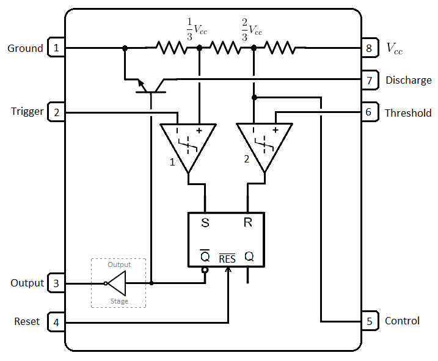
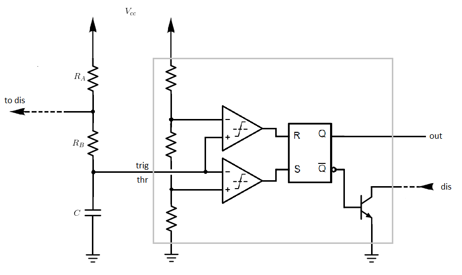

[comparator]: https://en.wikipedia.org/wiki/Comparator#:~:text=In%20electronics%2C%20a%20comparator%20is,The%20output%20is%20ideally "Comparator"
[sr latch]: https://www.allaboutcircuits.com/textbook/digital/chpt-10/s-r-latch/ "SR Latch"

### Introduction:
> Note: This lexicon entry will discuss the 555 Timer's general functionality. One should always consult the datasheet of any particular 555 IC for specifications unique to that chip.

The 555 Timer IC is a versatile chip that is in wide use. It is most commonly used for timing and clocking functions, but can also be used as an oscillator, SR latch, and more. This entry will discuss the chip's three primary operating modes, the astable, bistable, and monostable modes.

### A Glance Inside:

Above is a schematic of the essential components of the 555 IC. Here are a few things to make note of at the outset:
* The three resistors between pins 1 and 8 are the same value. Thus, they will equally divide [IMATH]V_{cc}[/IMATH] in three, as indicated on the schematic. (These three resistors are usually *5kΩ* and are the namesake of the IC).
* The Control Voltage (*ctrl*) pin is a special purpose pin that often goes unused. Thus, you will see that in most applications it is simply connected to ground through a small capacitor (typically *10 nF* ) to stabilize it at [IMATH]\frac{2}{3} V_{cc}[/IMATH].
* The Trigger (*trig*) pin will determine the output of [comparator][comparator] 1, as the comparator's other input terminal is fixed at [IMATH]\frac{1}{3} V_{cc}[/IMATH]. Likewise, the Threshold (*thr*) pin will determine the output of comparator 2 as the comparator's other input terminal is fixed at [IMATH]\frac{2}{3} V_{cc}[/IMATH] (with exception of use of the *ctrl* pin, as discussed above). Together, the *trig* and *thresh* pins (generally) determine the Output (*out*) of the IC.
* In the schematic shown, there is a grey dashed box labelled Output Stage. This is simply to indicate that there is more going on than what is shown. However, the important thing to know is that the signal is inverted.
* Setting the Reset (*res*) pin to logic low will override all other inputs and set the *out* pin to logic low.

To get an initial feel for the chip, let's consider how the primary inputs, *trig* and *thr*, effect the *out* and Discharge (*dis*) pins. This will not immediately elucidate the chip's operation, but it will come in handy later.

Let [IMATH]H[/IMATH] stand for logic high and [IMATH]L[/IMATH] stand for logic low. Also, assume [IMATH]H > \frac{2}{3} V_{cc}[/IMATH] and [IMATH]L < \frac{1}{3} V_{cc}[/IMATH].

The output of comparator 1, which is the Set (*S*) pin on the [SR latch][sr latch], will be H when *trig* is L and L when *trig* is H. Likewise, the output of comparator 2, which is the Reset (*R*) pin on the SR latch, will be L when *thr* is L and H when *thr* is H. Since the output of the 555 IC is essentially the output of this SR latch we can see that when *trig* and *thr* are both L, *out* is H, when *trig* and *thr* are both H, *out* is L, and finally when *trig* is H and *thr* is L, the output maintains its current value.

Finally, make note of the *dis* pin's relationship to our primary inputs. The *dis* pin is connected to the collector of an NPN transistor, which is controlled at the base by [IMATH]\overline{Q}[/IMATH] . As the name 'Discharge' indicates, when the base of the transistor is H (activating the transistor) this allows current to flow through (perhaps discharging a capacitor or some other component) the *dis* pin.

### The Astable Operating Mode:
#### Astable Mode — Big Picture:

The astable mode of the 555 IC generates a square wave. Let's begin our analysis of this configuration by first seeing the astable configuration in action. Open the [url](https://everycircuit.com/circuit/6574783370362880) below in a new tab &mdash; you can see that so configured, the 555 IC produces a square wave at the output (orange).

[Astable Mode Simulation](https://everycircuit.com/circuit/6574783370362880)

> *Note: if you have trouble loading the linked simulation above, be sure to (a) use Chrome, Firefox, or Edge; (b) enable your browser's native client setting (e.g., chrome://flags/#enable-nac)*

#### Astable Mode — Qualitative Analysis:
Let's strip down this circuit to its essential parts to understand its operation. Inside the grey box in the schematic below are the components contained in the 555 IC that are used in the astable operating mode. Outside the gray box are the external components added to create the astable configuration. Note that the *dis* pin is connected between  and [IMATH]R_A[/IMATH]:

As is often the case, the key to oscillation in this circuit is a capacitor. This capacitor links the *trig* and *thresh* pins to ground and is charged through [IMATH] R_A [/IMATH] and [IMATH]R_B[/IMATH]. The basic operation of this circuit can be understood in two stages:

1. At [IMATH]t = 0[/IMATH] the capacitor voltage, [IMATH]V_c \equiv V_{trig} \equiv V_{thresh} = L[/IMATH]. From the table above we see that [IMATH]out(t + 1) = H[/IMATH] . Additionally, dis is Off and thus the capacitor is unable to discharge through [IMATH]R_B[/IMATH].

